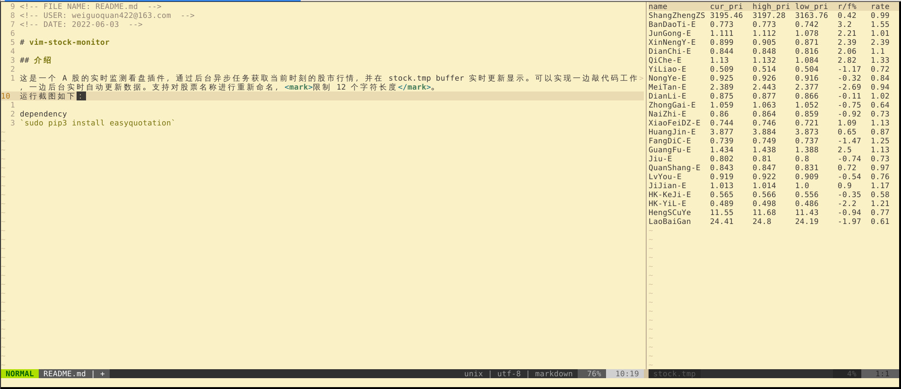
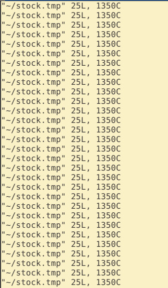
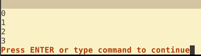

<!-- FILE NAME: README.md  -->
<!-- USER: weiguoquan422@163.com  -->
<!-- DATE: 2022-06-03  -->

# vim-stock-monitor

## 介绍

这是一个 A 股的实时监测看盘插件，通过后台异步任务获取当前时刻的股市行情，并在 stock.tmp buffer 实时更新显示。可以实现一边敲代码工作，一边后台实时自动更新数据，这里需要注意的是它更新 buffer 是通过 `set autoread` 来实现的，所以它更新的条件是当你的光标在某个位置悬停两秒后触发更新，或者是当运行外部 ex 命令后也会更新，默认的获取数据间隔是 10s 。支持对股票名称进行重新命名，<mark>限制 12 个字符长度</mark>。<br>

运行命令： `:call Stock_monitor_main()<CR>`<br>
关闭再次运行次命令即可.<br>
运行截图如下：<br>
<br>

## 安装
首先需<br>要安装依赖：
`sudo pip3 install easyquotation`<br>

插件安装，推荐使用 plug 插件管理软件：<br>
`Plug 'weiguoquan422/vim-stock-monitor'`<br>

## 配置

1. 快捷键<br>
`nmap <Leader>aa :call Stock_monitor_main()<CR>`<br>

2. 配置 updatetime<br>
`set updatetime=2000`<br>
次配置让光标悬停 2 秒后更新 buffer 显示，不设置默认是 4 秒。<br>

3. 全局变量<br>
* g:vim_stock_monitor_install_dir<br>
配置了插件的安装目录<br>
`let g:vim_stock_monitor_install_dir = '/home/' . $USER . '/.local/share/nvim/plugged/vim-stock-monitor/'` 默认是 home 目录下的 plug 插件目录，如果你的安装目录不是这个，需要改成你自己的插件安装目录到 vim-stock-monitor/ 这一层，注意 `/` 是必须写的。<br>

* g:vim_stock_monitor_tmp_file_dir<br>
配置 stock.tmp 文件的目录<br>
`let g:vim_stock_monitor_tmp_file_dir = '/home/' . $USER . '/'` 默认 home 目录下，推荐使用默认，即你可以不配置此项。<br>

* g:REPEAT_GET_STOCK_INTERVAL and g:REPEAT_GET_STOCK_TIMES<br>
`let g:REPEAT_GET_STOCK_INTERVAL = 10`<br>
`let g:REPEAT_GET_STOCK_TIMES = 900`<br>
这两项配置了时间间隔和重复获取股票行情的次数，默认设置 10 秒重复 900 次，即 9000 秒，对应 150 分钟， 2.5 小时，这是最长的开盘时间了，当然你可以根据这个逻辑自己设置。<br>

4. 设置你想要获取的股票<br>
在插件安装目录下面有 `plugin/config_list.py` <br>

```python
#config list read
stock_config_list = [
'sh000001','ShangZhengZS',
'159813',  'BanDaoTi-E'  ,
'512660',  'JunGong-E'   ,
'159752',  'XinNengY-E'  ,
'159767',  'DianChi-E'   ,
'516110',  'QiChe-E'     ,
'512170',  'YiLiao-E'    ,
'159825',  'NongYe-E'    ,
'515220',  'MeiTan-E'    ,
'159611',  'DianLi-E'    ,
'513050',  'ZhongGai-E'  ,
'513100',  'NaiZhi-E'    ,
'159732',  'XiaoFeiDZ-E' ,
'518880',  'HuangJin-E'  ,
'512200',  'FangDiC-E'   ,
'515790',  'GuangFu-E'   ,
'512690',  'Jiu-E'       ,
'159842',  'QuanShang-E' ,
'159766',  'LvYou-E'     ,
'516950',  'JiJian-E'    ,
'159740',  'HK-KeJi-E'   ,
'513060',  'HK-YiL-E'    ,
'600305',  'HengSCuYe'   ,
'600559',  'LaoBaiGan'   ,
]
```

第一列是股票代码，第二列是重命名，重命名可以为空，则自动获取该股票代码的名称，不能超过 12 个英文字符和 6 个汉字。<br>

## 目前存在的问题

1.每次自动更新后都会在命令行显示 stock.tmp 文件更新了，很烦人，且无法设置不提示这个消息。目前的方案是通过 `echo ''` 打印空来刷新掉这个提示。通过 :message 显示打印的这些烦人消息：<br>


2.这个插件默认启动前 40 多秒时间内在命令行打印 0 1 2 3 消息，还不知道如何解决，不过这个没有任何负面影响。<br>


希望对于这两个问题有解决方案的，可以提出。<br>
